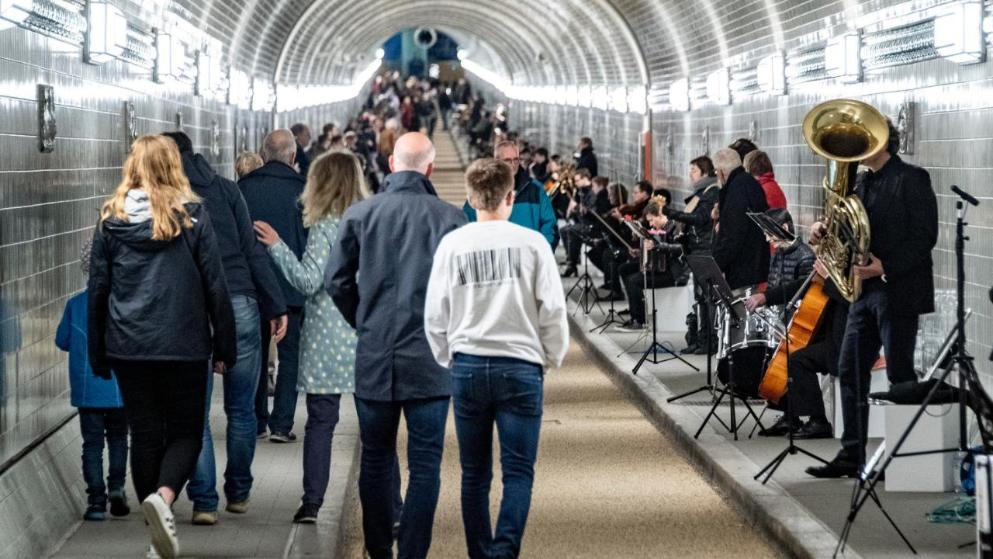

`drawsocket` is an node.js based server/client platform for generating synchronized, browser-based displays across an array of networked devices.

Developed at the Hochschule für Musik und Theater Hamburg in 2019 for a series of [large scale concerts in the St.Pauli-Elbtunnel as part of the Innovative Hochschule Stage_2.0 project](https://www.hfmt-hamburg.de/innovative-hochschule/zm4/symphonie-im-st-pauli-elbtunnel/?L=0), `drawsocket` was conceived as a system for distributed notation display over a local area network for use in music and spatial performance contexts.

`drawsocket` provides a unified interface for controlling diverse media features of web-browsers (SVG, WebAudio, animation, etc.), which can be utilized in many ways--and additionally provides access to browser mouse and multi-touch gesture interaction data, which can be used for the creating of graphical user interfaces.

